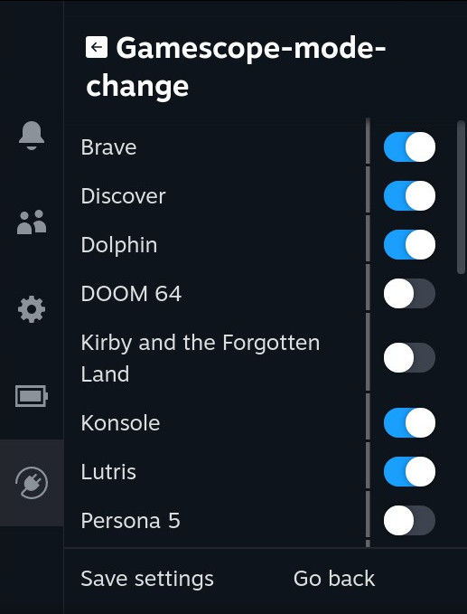
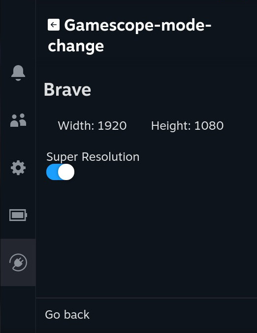
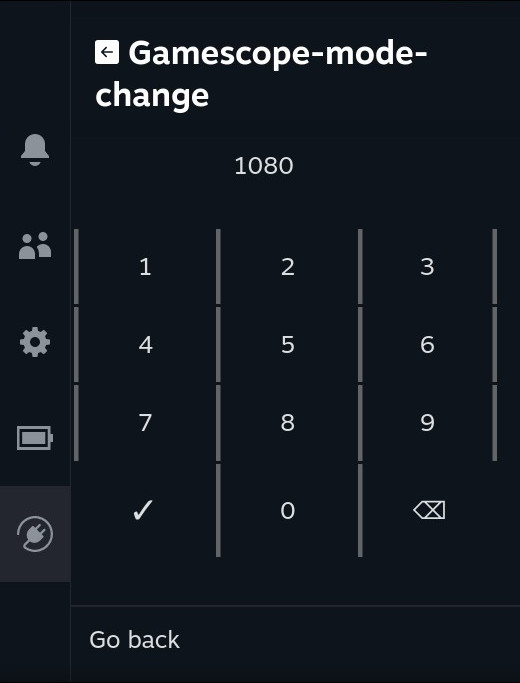

[Steam Deck Plugin Loader](https://github.com/SteamDeckHomebrew/PluginLoader) to modify the nested resolution as seen by your games.

## Installation:
1. Ensure you have [Steam Deck Plugin Loader](https://github.com/SteamDeckHomebrew/PluginLoader) installed
2. git clone https://github.com/loki-47-6F-64/gamescope-mode-change.git
3. cd gamescope-mode-change
4. git submodule update --init
5. Copy gamescope-mode-change to `/path/to/homebrew/plugins/gamescope-mode-change`

## Main page:



* This is a complete list of all Non-Steam games in your Steam Library
* By clicking on an app, you'll open the settings page for that particular app
* By clicking on `Save settings`, Gamescope-mode-change will remember your settings even if the toggle has been set to off.

## Settings page:


* By default, Gamescope-mode-change will set the resolution to the native resolution of your current monitor.
* If Super Resolution is toggled off, the resolution will be set to Native or Width/Height, whichever is lower, otherwise it will force your configures Width/Height
* If either Width or Height is set to Native, Super Resolution will effectively be set to off.
* By clicking on either Width or Height, you'll be able to set the Width or Height respectively.


## Dial page:


* Should be pretty straightforward


Gamescope-mode-change works by modifying the launch options of your game, wich will make Steam run a script right before starting the game.
```
--fullscreen
```
becomes
```
/path/to/homebrew/plugins/gamescope-mode-change/gamescope-mode-change.py --id=1 --nestedWidth=${width} --nestedHeight=${height} xX-gamescope-Xx && %command% --fullscreen
```

and
```
ENVIRONMENT_VAR=VALUE %command% --fullscreen
```
becomes
```
/path/to/homebrew/plugins/gamescope-mode-change/gamescope-mode-change.py --id=1 --nestedWidth=${width} --nestedHeight=${height} xX-gamescope-Xx && ENVIRONMENT_VAR=VALUE %command% --fullscreen
```


If you wish to change launch options for your game while the script is active, be sure to do so after `xX-gamescope-Xx && `. <- please do not forget the extra space after `&&`


Good luck :)